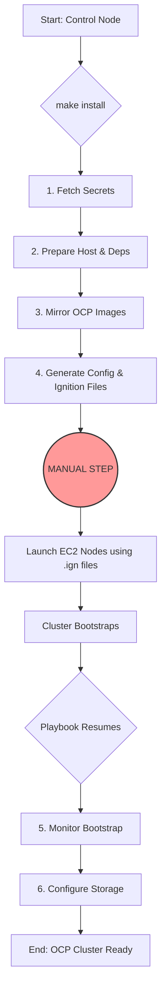

# Ansible for Disconnected OpenShift Installation on AWS

This project provides a robust and repeatable method for deploying an OpenShift Container Platform (OCP) cluster in a 
disconnected (air-gapped) environment on pre-existing AWS infrastructure. It uses Ansible for automation and follows 
the User-Provisioned Infrastructure (UPI) installation pattern.

The entire workflow is orchestrated via a simple Makefile, providing a streamlined interface for testing and execution, 
with secure secret management integrated via HashiCorp Vault or AWS Secrets Manager.

## Features

- **Automated UPI Deployment**: Automates the OpenShift installation process on infrastructure you've already provisioned.
- **Secure Secret Management**: Integrates with HashiCorp Vault and AWS Secrets Manager to avoid storing plaintext secrets in version control.
- **Disconnected-First**: Designed specifically for air-gapped environments by handling local image mirroring.
- **Idempotent by Design**: Ansible and Makefile tasks are idempotent, meaning they can be run multiple times safely.
- **Integrated Testing**: Includes commands for linting, syntax checking, and performing a "dry run" to validate changes before deployment.
- **Simple Orchestration**: A Makefile provides a user-friendly interface for the entire lifecycle of the deployment.

## Installation Workflow

The project follows a clear workflow, with one crucial manual step for launching the cluster nodes.



## Prerequisites

Before you begin, ensure the following requirements are met.

### 1. Control Node

The machine where you will run ansible and make.

- **Python**: Version 3.8 or newer, with pip.
- **Ansible & Libraries**: Install required Python packages from requirements.txt.
  ```bash
  pip install -r requirements.txt
  ```
- **Git**: To clone this repository.

### 2. Target Installation Host (Bastion)

The remote machine defined in your inventory.ini.

- **Podman or Docker**: Required for the oc mirror command.
- **Network Access**:
  - Initial internet access to download OCP tools and images.
  - Persistent access to your disconnected VPC and local container registry.

### 3. AWS Environment (Pre-provisioned)

- A VPC with private subnets. Note: For high availability, the standard is one private subnet per Availability Zone.
- An Amazon EFS file system accessible from your subnets.
- Correctly configured IAM Roles for EC2 instances that will become OpenShift nodes.
- Security Groups allowing necessary traffic between nodes.

### 4. Secret Management Backend

- **If using AWS Secrets Manager**: The control node must have AWS credentials configured (e.g., via `~/.aws/credentials` or an instance profile) with `secretsmanager:GetSecretValue` permissions.
- **If using HashiCorp Vault**: The control node must have `VAULT_ADDR` and `VAULT_TOKEN` environment variables set.
- **If using local variables**: You have the plaintext secrets ready.

## Project Structure

```
.
├── Makefile                  # Main orchestrator for testing and deployment
├── playbook.yml              # Main Ansible playbook
├── inventory.ini             # Your Ansible inventory file
├── README.md                 # This documentation
├── requirements.txt          # Python dependencies
└── roles/
    └── openshift_disconnected_install/
        ├── defaults/main.yml # <-- CONFIGURE YOUR CLUSTER VARIABLES HERE
        ├── meta/main.yml     # Role metadata
        ├── tasks/            # Ansible tasks for each step
        └── templates/        # Jinja2 templates for config files
```

## Quick Start Guide

Follow these steps to deploy your OpenShift cluster.

### Step 1: Clone the Repository & Install Dependencies

```bash
git clone <your-repo-url>
cd ansible-ocp-install
pip install -r requirements.txt
make deps
```

### Step 2: Configure Ansible Inventory

Edit the `inventory.ini` file to point to your installation/bastion host.

```ini
# inventory.ini
[installation_host]
bastion.my-ocp-environment.com ansible_user=ansible

[all:vars]
ansible_python_interpreter=/usr/bin/python3
```

### Step 3: Configure Cluster Variables

This is the most important step. Edit `roles/openshift_disconnected_install/defaults/main.yml` and provide the values for your specific environment. Pay close attention to the `secrets_backend` variable.

1. Choose your `secrets_backend`: `vars`, `aws_secrets_manager`, or `hashicorp_vault`.
2. Fill out the variables for your chosen backend as described in the "Secret Management" section below.
3. Configure the rest of the cluster details (`cluster_name`, `base_domain`, `aws_subnet_ids`, etc.).

### Step 4: Test the Playbook

Before executing, run all built-in tests. This will lint the code, check syntax, and perform a "dry run" to simulate the playbook's execution.

```bash
make test
```

### Step 5: Run the Installation

Start the deployment process. The playbook will run until it generates the Ignition files and then pause.

```bash
make install
```

### Step 6: MANUAL STEP - Launch Cluster Nodes

> **Warning**: The playbook will pause after creating the Ignition (.ign) files. You must now manually launch your EC2 instances. The automation will resume once the cluster begins to initialize.

1. Access the installation host. The Ignition files are located in the `ocp_install_dir` (e.g., `/home/ansible/ocp-install`).
2. Launch your EC2 instances with the correct AMI (the required AMI ID is noted by the installer).
3. For each instance type, copy the full contents of the corresponding .ign file and paste it into the User Data field in the EC2 launch wizard.
   - **Bootstrap Node (1)**: Use `bootstrap.ign`.
   - **Controller Nodes (3)**: Use `master.ign`.
   - **Worker & Infra Nodes (3 + 3)**: Use `worker.ign`.

Once the nodes are launched with the correct user data, the cluster bootstrap process will begin. The `make install` command, which is waiting, will detect this and proceed to the final steps.

## Secret Management

This role can pull sensitive variables like the `pullSecret` and `sshKey` from HashiCorp Vault, AWS Secrets Manager, or from the Ansible variables file directly. This is controlled by the `secrets_backend` variable in `defaults/main.yml`.

### Method 1: vars (Default)

The role will use the plaintext values `local_pull_secret_plaintext` and `ssh_public_key_plaintext` from the defaults file. This is useful for development and testing.

- **Set**: `secrets_backend: "vars"`

### Method 2: aws_secrets_manager

The role will use the `community.aws.aws_secret` lookup to fetch secrets. The Ansible controller (or machine running make) must have valid AWS credentials and IAM permissions for `secretsmanager:GetSecretValue`.

- **Set**: `secrets_backend: "aws_secrets_manager"`
- **Configure**:
  - `aws_secret_region`: The AWS region where secrets are stored.
  - `aws_pull_secret_name`: The name or ARN of the secret containing the pull secret.
  - `aws_ssh_key_secret_name`: The name or ARN of the secret for the SSH public key.

### Method 3: hashicorp_vault

The role will use the `community.hashi_vault.vault_lookup` plugin. The machine running Ansible must have the `VAULT_ADDR` and `VAULT_TOKEN` environment variables set.

- **Set**: `secrets_backend: "hashicorp_vault"`
- **Configure**:
  - `vault_pull_secret_path`: Path to the secret in Vault (e.g., `secret/data/openshift`).
  - `vault_pull_secret_key`: The key for the pull secret within that path.
  - `vault_ssh_key_path`: Path for the SSH key secret.
  - `vault_ssh_key_key`: The key for the SSH public key.

## Makefile Targets

All project tasks are managed through the Makefile.

| Command | Description |
|---------|-------------|
| `make help` | Show the help message with all available targets. |
| `make deps` | Install pre-flight dependencies (Ansible collections). |
| `make lint` | Lint the Ansible playbook and roles for style and errors. |
| `make syntax-check` | Check the Ansible playbook for syntax errors. |
| `make dry-run` | Run the playbook in check mode (no changes will be made). |
| `make test` | Run all tests (lint, syntax-check, dry-run). |
| `make install` | Run the full installation playbook. |
| `make clean` | **DANGER**: Remove all generated installation artifacts. |

## Troubleshooting

### Image Mirroring Fails
Ensure the installation host has sufficient disk space (~150-200GB free) and stable internet access for the initial download. Check credentials for your local registry.

### Secrets Not Found
Double-check your backend configuration (`secrets_backend` variable), secret names/paths, and that the control node has the correct credentials/tokens and permissions.

### Bootstrap Doesn't Complete
- Verify that the EC2 nodes were launched with the correct User Data from the Ignition files.
- Check security groups to ensure nodes can communicate with each other on all required ports.
- Check DNS resolution for the cluster API endpoints.